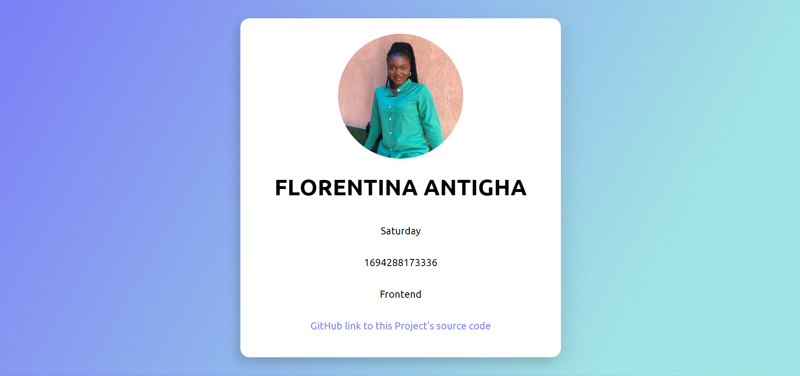

# Project - Slack Profile Web page.

This is the Stage One task for the Frontend track of HNG internships by Zuri Teams.
Completed on Saturday, 9th of September, 2023.

## Table of contents

- [Overview](#overview)
  - [The Challenge](#the-challenge)
  - [Screenshot](#screenshot)
- [My process](#my-process)
  - [Built with](#built-with)

  ## Overview 

  ### The Challenge

  Frontend Page Creation with Specific Elements:

  - Objective: Develop and host a web page using HTML, CSS and JS that showcases specific personal and real-time data attributes. Each required element should have a specified data-testid attribute for easy identification and testing.

  ### Screenshot

    

 ## My Process

  ### Built with

  - HTML5
  - CSS
  - Javascript 

 ## Author

  - Miss Florentina Nkoyo Antigha